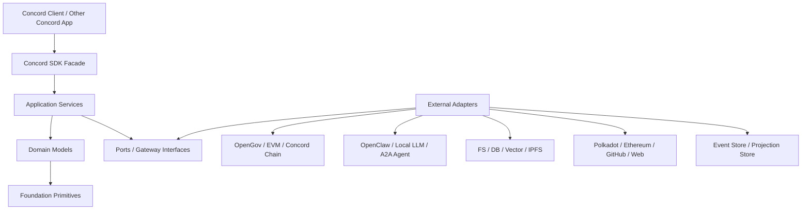
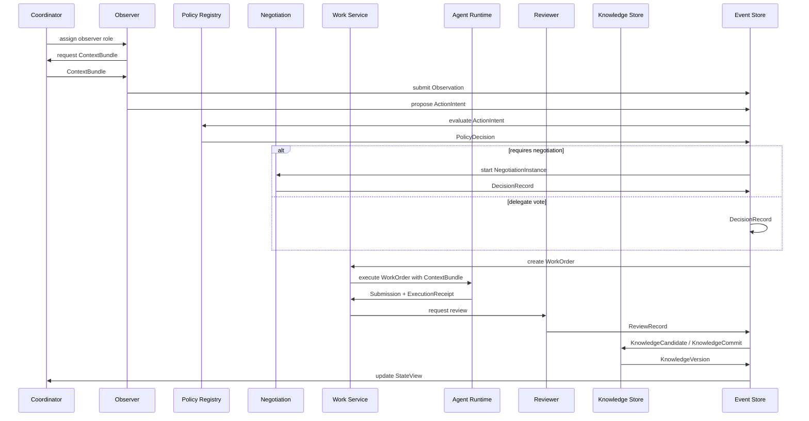

以下是基于你上传的 Concord 产品定义整理出的 **Concord SDK 架构设计草案**，目标是可以直接交给 Codex 作为后续实现参考。

# Concord SDK 架构设计

## 1. SDK 定位

Concord SDK 不是一个 Agent Runtime，也不是一个治理系统，而是一个 **开放 Agent 协作网络的协调内核**。

它负责定义：

* Agent 如何在一致上下文下行动
* Action 如何被 Policy 路由到投票、协商、评审、治理或执行
* 协商如何结构化并产生可审计结果
* 任务如何生成、领取、提交、评审
* 知识如何从候选状态进入正式版本
* 激励、治理、质押、结算如何通过 adapter 接入

它不负责：

* 具体链实现
* 具体数据库实现
* 具体 Agent Runtime
* 具体 UI
* 具体 OpenGov / EVM ABI
* 具体业务目标

一句话：

> Concord SDK 只定义协作秩序，不定义具体世界。

---

## 2. 总体架构



依赖方向必须保持：

```txt
Foundation <- Domain <- Application Services <- SDK Facade
                                      ^
                                      |
                                  Ports
                                      ^
                                      |
                                  Adapters
```

核心规则：

> SDK Core 不能 import 任何 adapter。
> Adapter 可以 import SDK 的 port/interface/type。

---

## 3. 推荐技术栈

### 3.1 第一版 SDK

建议使用 **TypeScript-first**。

理由：

* 更适合 Agent、Web、Node、Server、Client 集成
* 更容易对接 OpenClaw、A2A、MCP、前端应用
* 方便发布 npm packages
* 方便 Codex 生成和维护
* 适合用 JSON Schema 暴露协议对象

### 3.2 后续可补充 Rust

Rust 适合放在：

* hash / canonical encoding
* proof / receipt verification
* high-performance indexer
* chain-side client
* WASM verifier

但不建议 MVP 一开始用 Rust 写完整 SDK，否则会增加集成成本。

---

## 4. Monorepo 包结构

```txt
concord/
  packages/
    foundation/
    domain/
    schemas/
    policy/
    negotiation/
    work/
    review/
    knowledge/
    state/
    runtime/
    incentive/
    governance/
    coordinator/
    sdk/

  adapters/
    memory/
    fs-knowledge/
    postgres-store/
    sqlite-store/
    opengov/
    evm-governor/
    evm-escrow/
    substrate-state/
    ethereum-state/
    github-state/
    openclaw-runtime/
    a2a-runtime/
    mcp-tools/

  apps/
    mvp-runner/
    coordinator-api/
    node-client/
    dev-console/

  examples/
    simple-loop/
    knowledge-commit/
    delegate-vote/
    funding-request/
```

---

# 5. Package 设计

## 5.1 `@concord/foundation`

最底层技术原语。

### 职责

* ID
* Hash
* Version
* Timestamp
* Result
* Error
* EventEnvelope
* ArtifactRef
* SchemaRef
* SignatureRef
* ReceiptRef

### 示例类型

```ts
export type Id<T extends string> = string & { readonly __brand: T };

export type ActorId = Id<"ActorId">;
export type ActionId = Id<"ActionId">;
export type EventId = Id<"EventId">;
export type KnowledgeVersionId = Id<"KnowledgeVersionId">;

export interface Hash {
  algorithm: "sha256" | "blake2b" | "keccak256";
  value: string;
}

export interface Version {
  value: string;
}

export interface Timestamp {
  iso: string;
}

export interface ArtifactRef {
  uri: string;
  hash?: Hash;
  mediaType?: string;
  schema?: SchemaRef;
}

export interface EventEnvelope<TType extends string, TPayload> {
  id: EventId;
  type: TType;
  version: Version;
  timestamp: Timestamp;
  actorId?: ActorId;
  causationId?: EventId;
  correlationId?: string;
  payload: TPayload;
  hash?: Hash;
  signature?: SignatureRef;
}
```

### 关键要求

所有可审计对象都应支持：

* stable serialization
* hash
* version
* schema
* optional signature

---

## 5.2 `@concord/domain`

定义 Concord 的核心领域对象。

### 核心对象

```txt
Actor
RoleAssignment
Goal
StateView
ContextBundle
ContextReceipt
KnowledgeCandidate
KnowledgeCommit
KnowledgeVersion
ActionIntent
ActionPolicy
PolicyDecision
NegotiationInstance
DecisionRecord
WorkOrder
Submission
ReviewRecord
IncentiveIntent
GovernanceIntent
HumanRequest
ExecutionReceipt
```

### Actor

```ts
export interface Actor {
  id: ActorId;
  kind: "agent" | "human" | "service" | "guardian";
  displayName?: string;
  identities: IdentityBinding[];
  capabilities?: CapabilityDescriptor[];
  metadata?: Record<string, unknown>;
}

export interface IdentityBinding {
  namespace: string;
  subject: string;
  proof?: ArtifactRef;
}
```

### RoleAssignment

```ts
export type ConcordRole =
  | "observer"
  | "candidate_observer"
  | "delegate"
  | "member"
  | "reviewer"
  | "guardian";

export interface RoleAssignment {
  actorId: ActorId;
  role: ConcordRole;
  scope: {
    goalId?: GoalId;
    loopId?: LoopId;
    actionId?: ActionId;
  };
  validFrom: Timestamp;
  validUntil?: Timestamp;
  source: "policy" | "coordinator" | "governance" | "manual";
}
```

---

## 5.3 `@concord/state`

负责 Concord 内部状态视图，而不是外部链状态本身。

### 核心原则

状态不是原语。

状态是：

> event log + artifact + external observation 的投影。

### 核心对象

```ts
export interface StateView {
  id: StateViewId;
  version: Version;
  checkpoint: EventCheckpoint;
  knowledgeVersionId: KnowledgeVersionId;
  projectionHash: Hash;
  createdAt: Timestamp;
}

export interface EventCheckpoint {
  latestEventId: EventId;
  eventRoot: Hash;
  height?: number;
}
```

### State Store Port

```ts
export interface EventStore {
  append<T extends EventEnvelope<string, unknown>>(event: T): Promise<void>;
  appendMany(events: EventEnvelope<string, unknown>[]): Promise<void>;

  get(eventId: EventId): Promise<EventEnvelope<string, unknown> | null>;

  query(input: {
    from?: EventId;
    type?: string[];
    correlationId?: string;
    limit?: number;
  }): Promise<EventEnvelope<string, unknown>[]>;
}

export interface ProjectionStore {
  getStateView(id: StateViewId): Promise<StateView | null>;
  getLatestStateView(scope: ProjectionScope): Promise<StateView | null>;
  saveStateView(view: StateView): Promise<void>;
}
```

### External State Source Port

```ts
export interface StateSourceAdapter {
  id: string;

  observe(input: StateObservationRequest): Promise<StateObservationResult>;

  query?(input: StateQuery): Promise<StateQueryResult>;
}
```

例如：

* Polkadot chain state adapter
* Ethereum state adapter
* GitHub issue adapter
* Forum adapter
* Web page adapter

外部观察结果不能直接成为正式状态，只能成为 `ObservationArtifact`。

---

## 5.4 `@concord/knowledge`

负责知识版本、候选知识、正式知识、废弃知识、争议知识。

### 核心对象

```ts
export interface KnowledgeVersion {
  id: KnowledgeVersionId;
  parentId?: KnowledgeVersionId;
  hash: Hash;
  createdAt: Timestamp;
  createdBy: ActorId;
  commitIds: KnowledgeCommitId[];
}

export interface KnowledgeCandidate {
  id: KnowledgeCandidateId;
  proposedBy: ActorId;
  source: ArtifactRef;
  summary?: string;
  targetLayer:
    | "bootstrap"
    | "protocol"
    | "skill"
    | "external_input"
    | "formal"
    | "deprecated"
    | "disputed";
  context: ContextReceipt;
}

export interface KnowledgeCommit {
  id: KnowledgeCommitId;
  candidateIds: KnowledgeCandidateId[];
  decisionRecordId: DecisionRecordId;
  parentVersionId: KnowledgeVersionId;
  nextVersionHash: Hash;
}
```

### Knowledge Store Port

```ts
export interface KnowledgeStore {
  getVersion(id: KnowledgeVersionId): Promise<KnowledgeVersion | null>;
  getLatestVersion(scope: KnowledgeScope): Promise<KnowledgeVersion | null>;

  getCandidate(id: KnowledgeCandidateId): Promise<KnowledgeCandidate | null>;
  saveCandidate(candidate: KnowledgeCandidate): Promise<void>;

  commit(input: KnowledgeCommitInput): Promise<KnowledgeVersion>;

  diff(input: KnowledgeDiffInput): Promise<KnowledgeDiffResult>;

  materialize(input: {
    versionId: KnowledgeVersionId;
  }): Promise<KnowledgeMaterialization>;
}
```

### 关键规则

* Agent 不能直接写正式知识库
* 所有正式知识必须经过 `KnowledgeCandidate -> Review -> KnowledgeCommit`
* 每个 `KnowledgeVersion` 必须有 hash
* 每个 `ContextBundle` 必须绑定一个 `KnowledgeVersion`

---

## 5.5 `@concord/context`

可以并入 `state`，也可以单独成包。建议 MVP 独立，避免上下文逻辑污染 state。

### ContextBundle

```ts
export interface ContextBundle {
  id: ContextBundleId;
  goalId: GoalId;
  loopId?: LoopId;

  stateViewId: StateViewId;
  stateViewVersion: Version;

  knowledgeVersionId: KnowledgeVersionId;
  knowledgeHash: Hash;

  protocolVersion: Version;
  actionPolicyVersion: Version;

  artifacts: ArtifactRef[];

  createdAt: Timestamp;
  expiresAt?: Timestamp;
}

export interface ContextReceipt {
  contextBundleId: ContextBundleId;
  stateViewId: StateViewId;
  stateViewVersion: Version;
  knowledgeVersionId: KnowledgeVersionId;
  knowledgeHash: Hash;
  protocolVersion: Version;
  actionPolicyVersion: Version;
  acceptedAt: Timestamp;
  actorId: ActorId;
}
```

### Context Service

```ts
export interface ContextService {
  createBundle(input: CreateContextBundleInput): Promise<ContextBundle>;

  acceptBundle(input: {
    actorId: ActorId;
    contextBundleId: ContextBundleId;
  }): Promise<ContextReceipt>;

  validateReceipt(input: {
    receipt: ContextReceipt;
    currentStateView: StateView;
    currentKnowledgeVersion: KnowledgeVersion;
  }): Promise<ContextValidationResult>;
}
```

### 提交一致性规则

任何 `Submission` 必须带：

* ContextReceipt
* KnowledgeHash
* StateViewVersion
* ProtocolVersion
* ExecutionReceipt

否则不能进入正式评审。

---

## 5.6 `@concord/policy`

Action Policy Registry 是 SDK 的核心组件。

### ActionIntent

```ts
export interface ActionIntent {
  id: ActionId;
  type: string;
  proposedBy: ActorId;
  goalId: GoalId;
  loopId?: LoopId;

  title: string;
  description: string;

  riskLevel: "low" | "medium" | "high" | "critical";

  context: ContextReceipt;
  inputs: ArtifactRef[];

  expectedOutputs?: ExpectedOutput[];

  requestedResources?: ResourceRequest[];

  createdAt: Timestamp;
}
```

### ActionPolicy

```ts
export interface ActionPolicy {
  id: ActionPolicyId;
  version: Version;

  actionType: string;

  eligibility: EligibilityRule[];

  requiredContext: RequiredContextRule[];

  decisionFlow:
    | "direct"
    | "delegate_vote"
    | "structured_negotiation"
    | "review_protocol"
    | "governance_request"
    | "guardian_review"
    | "reject";

  negotiationProtocolId?: NegotiationProtocolId;

  votingRule?: VotingRule;

  requiresGuardian?: boolean;

  produces?: Array<
    | "work_order"
    | "knowledge_candidate"
    | "funding_intent"
    | "governance_intent"
    | "human_request"
    | "settlement_intent"
  >;

  resultBinding: "advisory" | "binding" | "requires_external_execution";
}
```

### PolicyDecision

```ts
export interface PolicyDecision {
  id: PolicyDecisionId;
  actionId: ActionId;
  policyId: ActionPolicyId;
  result:
    | "approved_directly"
    | "requires_delegate_vote"
    | "requires_negotiation"
    | "requires_review"
    | "requires_governance"
    | "requires_guardian"
    | "rejected";

  reason: string;
  requiredNextStep?: RequiredNextStep;
  createdAt: Timestamp;
}
```

### Policy Registry

```ts
export interface ActionPolicyRegistry {
  getPolicy(actionType: string): Promise<ActionPolicy | null>;

  evaluate(input: {
    action: ActionIntent;
    actor: Actor;
    context: ContextBundle;
  }): Promise<PolicyDecision>;

  registerPolicy(input: {
    policy: ActionPolicy;
    decisionRecord: DecisionRecord;
  }): Promise<void>;
}
```

### 强制约束

> 任何 ActionIntent 都必须先经过 Policy Registry。
> 没有 PolicyDecision 的 action 不能进入执行、协商、评审、治理或结算。

---

## 5.7 `@concord/negotiation`

结构化协商模块。

### NegotiationInstance

```ts
export interface NegotiationInstance {
  id: NegotiationInstanceId;
  protocolId: NegotiationProtocolId;
  actionId: ActionId;

  topic: string;
  initiator: ActorId;
  participants: ActorId[];

  context: ContextReceipt;

  status:
    | "open"
    | "collecting_positions"
    | "revising"
    | "scoring"
    | "converged"
    | "failed"
    | "escalated"
    | "closed";

  rounds: NegotiationRound[];

  createdAt: Timestamp;
  closedAt?: Timestamp;
}
```

### Structured Position

```ts
export interface NegotiationPosition {
  actorId: ActorId;
  stance: "support" | "oppose" | "abstain" | "revise";
  rationale: string;
  evidence: ArtifactRef[];
  score?: number;
  proposedRevision?: ArtifactRef;
}
```

### DecisionRecord

```ts
export interface DecisionRecord {
  id: DecisionRecordId;
  source:
    | "delegate_vote"
    | "structured_negotiation"
    | "review"
    | "guardian"
    | "governance"
    | "manual";

  actionId?: ActionId;
  negotiationId?: NegotiationInstanceId;

  result: "approved" | "rejected" | "needs_revision" | "escalated";

  summary: string;

  approvals: ActorId[];
  rejections: ActorId[];
  abstentions: ActorId[];

  unresolvedIssues: string[];

  outputArtifacts: ArtifactRef[];

  createdAt: Timestamp;
}
```

### Negotiation Protocol

```ts
export interface NegotiationProtocol {
  id: NegotiationProtocolId;
  version: Version;

  create(input: CreateNegotiationInput): Promise<NegotiationInstance>;

  submitPosition(input: SubmitPositionInput): Promise<NegotiationInstance>;

  evaluate(input: {
    instance: NegotiationInstance;
  }): Promise<NegotiationEvaluation>;

  close(input: {
    instance: NegotiationInstance;
    evaluation: NegotiationEvaluation;
  }): Promise<DecisionRecord>;
}
```

### MVP 内置协议

第一版只需要内置：

```txt
delegate-fast-vote
simple-structured-negotiation
task-review
knowledge-commit-review
guardian-escalation
```

`root-negotiation-protocol` 可以只保留接口，不需要 MVP 实现。

---

## 5.8 `@concord/work`

任务、领取、执行、提交。

### WorkOrder

```ts
export interface WorkOrder {
  id: WorkOrderId;
  actionId: ActionId;
  goalId: GoalId;

  title: string;
  description: string;

  requiredCapabilities: CapabilityRequirement[];

  contextBundleId: ContextBundleId;

  reward?: RewardOffer;

  status:
    | "open"
    | "claimed"
    | "submitted"
    | "under_review"
    | "accepted"
    | "rejected"
    | "expired"
    | "cancelled";

  createdAt: Timestamp;
  expiresAt?: Timestamp;
}
```

### Claim

```ts
export interface WorkClaim {
  id: WorkClaimId;
  workOrderId: WorkOrderId;
  actorId: ActorId;
  claimedAt: Timestamp;
  leaseUntil?: Timestamp;
}
```

### Submission

```ts
export interface Submission {
  id: SubmissionId;
  workOrderId: WorkOrderId;
  submittedBy: ActorId;

  contextReceipt: ContextReceipt;
  executionReceipt: ExecutionReceipt;

  artifacts: ArtifactRef[];

  summary: string;

  submittedAt: Timestamp;
}
```

### Work Service

```ts
export interface WorkService {
  createWorkOrder(input: CreateWorkOrderInput): Promise<WorkOrder>;

  listOpenWorkOrders(input: ListWorkOrdersInput): Promise<WorkOrder[]>;

  claim(input: {
    actorId: ActorId;
    workOrderId: WorkOrderId;
  }): Promise<WorkClaim>;

  submit(input: SubmitWorkInput): Promise<Submission>;

  expire(input: {
    workOrderId: WorkOrderId;
    reason: string;
  }): Promise<void>;
}
```

---

## 5.9 `@concord/runtime`

Agent Runtime Adapter 抽象。

### Runtime Adapter

```ts
export interface AgentRuntimeAdapter {
  id: string;

  describeCapabilities(actorId: ActorId): Promise<CapabilityDescriptor[]>;

  execute(input: {
    actorId: ActorId;
    workOrder: WorkOrder;
    context: ContextBundle;
  }): Promise<RuntimeExecutionResult>;
}
```

### RuntimeExecutionResult

```ts
export interface RuntimeExecutionResult {
  submissionDraft: {
    summary: string;
    artifacts: ArtifactRef[];
  };

  executionReceipt: ExecutionReceipt;
}

export interface ExecutionReceipt {
  runtimeId: string;
  actorId: ActorId;
  startedAt: Timestamp;
  finishedAt: Timestamp;

  inputContext: ContextReceipt;

  toolCalls?: ArtifactRef[];
  logs?: ArtifactRef[];

  outputHash?: Hash;

  status: "success" | "failed" | "partial";
}
```

### 关键规则

Runtime 只能执行任务。

Runtime 不能决定：

* 任务是否通过
* 知识是否正式成立
* 奖励是否发放
* 协商是否成立
* 高风险 action 是否执行

---

## 5.10 `@concord/review`

任务评审、知识评审、结果验证。

### ReviewRecord

```ts
export interface ReviewRecord {
  id: ReviewRecordId;

  target:
    | { kind: "submission"; submissionId: SubmissionId }
    | { kind: "knowledge_candidate"; candidateId: KnowledgeCandidateId }
    | { kind: "action"; actionId: ActionId };

  reviewerId: ActorId;

  result: "accept" | "reject" | "needs_revision" | "escalate";

  score?: number;
  rationale: string;
  evidence: ArtifactRef[];

  contextReceipt: ContextReceipt;

  createdAt: Timestamp;
}
```

### Review Service

```ts
export interface ReviewService {
  requestReview(input: RequestReviewInput): Promise<ReviewRequest>;

  submitReview(input: SubmitReviewInput): Promise<ReviewRecord>;

  aggregate(input: {
    target: ReviewTarget;
  }): Promise<ReviewAggregation>;

  finalize(input: {
    target: ReviewTarget;
    decisionRecord: DecisionRecord;
  }): Promise<void>;
}
```

---

## 5.11 `@concord/incentive`

只定义激励意图，不绑定具体资金系统。

### IncentiveIntent

```ts
export interface IncentiveIntent {
  id: IncentiveIntentId;

  kind:
    | "reward_reserve"
    | "reward_claim"
    | "tip_request"
    | "slash_request"
    | "stake_lock"
    | "stake_release";

  actorId?: ActorId;
  workOrderId?: WorkOrderId;
  submissionId?: SubmissionId;
  decisionRecordId?: DecisionRecordId;

  amount?: AssetAmount;

  reason: string;
  evidence: ArtifactRef[];

  status:
    | "draft"
    | "approved"
    | "submitted_to_gateway"
    | "settled"
    | "rejected"
    | "disputed";
}
```

### Gateway Ports

```ts
export interface FundingGateway {
  reserve(input: FundingReserveInput): Promise<FundingReceipt>;

  claim(input: RewardClaimInput): Promise<FundingReceipt>;

  query(input: FundingQuery): Promise<FundingStatus>;
}

export interface StakeGateway {
  getStake(actorId: ActorId): Promise<StakeStatus>;

  lock(input: StakeLockInput): Promise<StakeReceipt>;

  requestSlash(input: SlashRequestInput): Promise<StakeReceipt>;
}

export interface PriceGateway {
  quote(input: PriceQuoteInput): Promise<PriceQuote>;
}
```

---

## 5.12 `@concord/governance`

只定义治理意图和治理网关。

### GovernanceIntent

```ts
export interface GovernanceIntent {
  id: GovernanceIntentId;

  kind:
    | "proposal_create"
    | "vote"
    | "execute"
    | "cancel"
    | "status_query";

  actionId?: ActionId;
  decisionRecordId?: DecisionRecordId;

  title: string;
  body: string;

  requestedExecution?: ArtifactRef;

  status:
    | "draft"
    | "approved"
    | "submitted"
    | "confirmed"
    | "executed"
    | "rejected"
    | "failed";
}
```

### GovernanceGateway

```ts
export interface GovernanceGateway {
  submitProposal(input: SubmitProposalInput): Promise<GovernanceReceipt>;

  vote(input: VoteInput): Promise<GovernanceReceipt>;

  execute(input: ExecuteGovernanceInput): Promise<GovernanceReceipt>;

  getStatus(input: GovernanceStatusQuery): Promise<GovernanceStatus>;
}
```

### OpenGov / EVM 位置

OpenGov 和 EVM 不进入 SDK Core。

它们只能作为：

```txt
@concord/adapter-opengov
@concord/adapter-evm-governor
@concord/adapter-evm-escrow
```

---

## 5.13 `@concord/coordinator`

Coordinator 在 SDK 中只能是接口和可替换实现。

### Coordinator Port

```ts
export interface CoordinationGateway {
  publishEvent(event: EventEnvelope<string, unknown>): Promise<void>;

  subscribe(input: SubscriptionInput): AsyncIterable<EventEnvelope<string, unknown>>;

  assignRole(input: RoleAssignmentRequest): Promise<RoleAssignment>;

  acquireLease(input: LeaseRequest): Promise<Lease>;

  broadcastContext(input: {
    contextBundle: ContextBundle;
    recipients?: ActorId[];
  }): Promise<void>;
}
```

### 关键约束

Coordinator 可以：

* 分发任务
* 聚合事件
* 广播上下文
* 管理协商实例
* 管理 leases
* 维护投影

Coordinator 不能直接决定：

* 知识正式成立
* 高风险 action 通过
* 奖励结算
* slash 生效
* 预算批准
* 协议升级

这些必须来自：

```txt
PolicyDecision
DecisionRecord
ReviewAggregation
GuardianDecision
GovernanceReceipt
FundingReceipt
```

---

## 5.14 `@concord/sdk`

对外 Facade。

### createConcord

```ts
export interface Concord {
  actors: ActorService;
  context: ContextService;
  state: StateService;
  knowledge: KnowledgeService;
  actions: ActionService;
  policies: ActionPolicyRegistry;
  negotiation: NegotiationService;
  work: WorkService;
  review: ReviewService;
  runtime: RuntimeService;
  incentive: IncentiveService;
  governance: GovernanceService;
  loop: LoopService;
}

export function createConcord(config: ConcordConfig): Concord;
```

### ConcordConfig

```ts
export interface ConcordConfig {
  eventStore: EventStore;
  projectionStore: ProjectionStore;

  knowledgeStore: KnowledgeStore;

  policyRegistry: ActionPolicyRegistry;

  coordination?: CoordinationGateway;

  runtimes?: AgentRuntimeAdapter[];

  stateSources?: StateSourceAdapter[];

  fundingGateway?: FundingGateway;
  stakeGateway?: StakeGateway;
  priceGateway?: PriceGateway;
  governanceGateway?: GovernanceGateway;
}
```

---

# 6. 核心运行流程

## 6.1 MVP Loop



---

## 6.2 Action 处理流程

```txt
1. Actor proposes ActionIntent
2. ActionService stores ActionProposed event
3. PolicyRegistry evaluates action
4. PolicyDecision is stored
5. Based on PolicyDecision:
   - direct -> execute
   - delegate_vote -> create voting instance
   - structured_negotiation -> create negotiation
   - review_protocol -> request review
   - governance_request -> create GovernanceIntent
   - guardian_review -> create GuardianRequest
   - reject -> close action
6. DecisionRecord is generated
7. DecisionRecord produces one or more:
   - WorkOrder
   - KnowledgeCandidate
   - GovernanceIntent
   - IncentiveIntent
   - HumanRequest
```

---

# 7. 事件模型

Concord SDK 应采用 event-first 架构。

## 7.1 核心事件类型

```txt
ActorRegistered
RoleAssigned
GoalCreated

StateObservationSubmitted
StateViewUpdated

KnowledgeCandidateCreated
KnowledgeReviewRequested
KnowledgeCommitted
KnowledgeVersionCreated

ContextBundleCreated
ContextReceiptSubmitted

ActionProposed
ActionPolicyEvaluated
ActionRejected
ActionApproved

NegotiationStarted
NegotiationPositionSubmitted
NegotiationRoundClosed
NegotiationDecisionRecorded

WorkOrderCreated
WorkOrderClaimed
WorkSubmitted
WorkReviewRequested
WorkReviewSubmitted
WorkAccepted
WorkRejected

IncentiveIntentCreated
FundingReserved
RewardClaimed
SlashRequested

GovernanceIntentCreated
GovernanceSubmitted
GovernanceStatusUpdated
GovernanceExecuted

HumanRequestCreated
GuardianDecisionRecorded
```

## 7.2 Event Envelope 规则

每个事件必须包含：

```txt
id
type
version
timestamp
actorId
causationId
correlationId
payload
hash
signature?
```

---

# 8. 权威来源设计

Concord SDK 中不应该有单一中心权威。

## 8.1 不同对象的权威来源

| 对象               | 权威来源                             |
| ---------------- | -------------------------------- |
| Event            | EventStore + hash                |
| StateView        | Projection from EventStore       |
| KnowledgeVersion | KnowledgeCommit + hash           |
| Action 执行资格      | PolicyDecision                   |
| 协商结果             | DecisionRecord                   |
| 任务结果             | ReviewRecord / ReviewAggregation |
| 奖励结算             | FundingReceipt                   |
| 治理状态             | GovernanceReceipt                |
| 高风险暂停            | GuardianDecision                 |
| Agent 执行声明       | ExecutionReceipt                 |
| 上下文一致性           | ContextReceipt                   |

## 8.2 Coordinator 的定位

Coordinator 只是：

> 事件分发器 + 临时调度器 + 投影维护者。

它不是最终仲裁者。

---

# 9. Adapter 设计

## 9.1 Adapter 分类

```txt
StateSourceAdapter
KnowledgeStore
AgentRuntimeAdapter
GovernanceGateway
FundingGateway
StakeGateway
PriceGateway
CoordinationGateway
EventStore
ProjectionStore
IdentityGateway
NotificationGateway
```

## 9.2 MVP 必需 Adapter

第一版只需要：

```txt
MemoryEventStore
MemoryProjectionStore
FileKnowledgeStore
MockRuntimeAdapter
SimpleCoordinatorGateway
MockFundingGateway
MockGovernanceGateway
```

这样可以先跑通完整闭环。

## 9.3 第二阶段 Adapter

```txt
PostgresEventStore
SQLiteEventStore
OpenClawRuntimeAdapter
A2ARuntimeAdapter
OpenGovAdapter
EVMGovernorAdapter
EVMEscrowAdapter
SubstrateStateAdapter
GitHubStateAdapter
VectorKnowledgeAdapter
```

---

# 10. MVP 应实现的最小闭环

## 10.1 必须实现

```txt
1. Actor 注册
2. Goal 创建
3. 初始 KnowledgeVersion
4. 初始 StateView
5. ContextBundle 创建
6. Observer 分配
7. Observation 提交
8. ActionIntent 提交
9. ActionPolicyRegistry 判断流程
10. Delegate Vote 或 Simple Negotiation
11. DecisionRecord 生成
12. WorkOrder 生成
13. Agent Runtime 执行
14. Submission 提交
15. Reviewer 评审
16. KnowledgeCandidate 创建
17. KnowledgeCommit
18. 新 KnowledgeVersion
19. 新 StateView
20. 下一轮 Loop
```

## 10.2 MVP 可暂缓

```txt
P2P
真实 OpenGov 集成
真实 EVM 合约
复杂声誉
复杂 slash
自动生成协商协议
完整链上知识库
完整女巫防御
复杂 UI
```

---

# 11. 推荐实现里程碑

## M0：Foundation + Domain

完成：

```txt
@concord/foundation
@concord/domain
@concord/schemas
```

目标：

* 所有核心对象有 TypeScript type
* 所有公开对象有 JSON Schema
* 支持 stable hash
* 支持 basic validation

---

## M1：Event Store + State Projection

完成：

```txt
@concord/state
@concord/adapters-memory
```

目标：

* append event
* query event
* build StateView
* create checkpoint
* event hash

---

## M2：Context + Knowledge

完成：

```txt
@concord/context
@concord/knowledge
@concord/adapters-fs-knowledge
```

目标：

* 创建 ContextBundle
* 生成 ContextReceipt
* 创建 KnowledgeCandidate
* commit KnowledgeVersion
* 校验 KnowledgeHash

---

## M3：Action Policy Registry

完成：

```txt
@concord/policy
```

目标：

* 注册 ActionPolicy
* 评估 ActionIntent
* 输出 PolicyDecision
* 阻止无 policy action

---

## M4：Negotiation + DecisionRecord

完成：

```txt
@concord/negotiation
```

目标：

* delegate fast vote
* simple structured negotiation
* structured positions
* generate DecisionRecord

---

## M5：Work + Runtime + Review

完成：

```txt
@concord/work
@concord/runtime
@concord/review
```

目标：

* WorkOrder
* Claim
* Submission
* RuntimeAdapter
* ReviewRecord
* ReviewAggregation

---

## M6：Incentive + Governance 抽象

完成：

```txt
@concord/incentive
@concord/governance
```

目标：

* FundingGateway interface
* GovernanceGateway interface
* Mock adapters
* IncentiveIntent
* GovernanceIntent

不接真实 OpenGov。

---

## M7：MVP Runner

完成：

```txt
apps/mvp-runner
```

目标：

用 mock adapter 跑通：

```txt
goal -> observer -> action -> policy -> negotiation -> work -> runtime -> review -> knowledge commit -> next state view
```

---

# 12. Codex 实现入口建议

可以给 Codex 的第一阶段任务：

```md
Implement Concord SDK M0-M1.

Requirements:

1. Use TypeScript.
2. Use pnpm workspace.
3. Create packages:
   - @concord/foundation
   - @concord/domain
   - @concord/schemas
   - @concord/state
   - @concord/adapters-memory
   - @concord/sdk
4. Implement stable JSON serialization and hash utility.
5. Implement EventEnvelope.
6. Implement in-memory EventStore.
7. Implement basic StateView projection.
8. Add unit tests.
9. Do not implement OpenGov, EVM, Concord Chain, or concrete Agent Runtime.
10. All external systems must be represented as ports/interfaces only.
```

---

# 13. 最重要的架构结论

Concord SDK 的核心不是任务系统，而是：

```txt
Context Consistency
+ Action Policy Routing
+ Structured Negotiation
+ Work Execution
+ Review
+ Knowledge Versioning
+ Incentive / Governance Intents
```

最终可以压缩为一个核心闭环：

```txt
Observe
 -> Propose Action
 -> Evaluate Policy
 -> Decide / Negotiate
 -> Generate Work
 -> Execute
 -> Review
 -> Commit Knowledge
 -> Update State
 -> Next Loop
```

SDK 最关键的设计原则是：

> 所有外部世界都是 adapter。
> 所有重要行动都必须经过 policy。
> 所有正式结果都必须有 receipt。
> 所有知识都必须版本化。
> Coordinator 不能成为最终权威。
